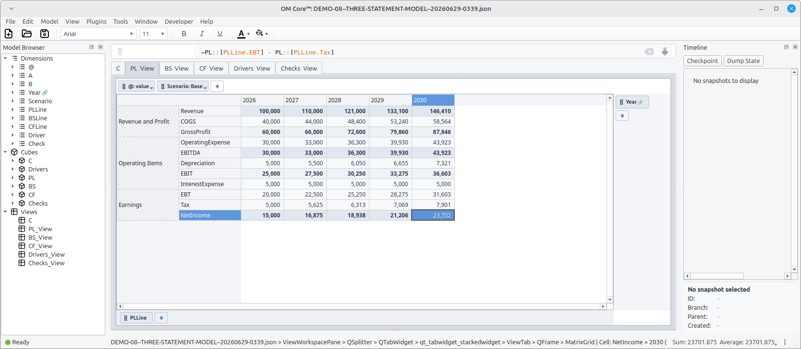
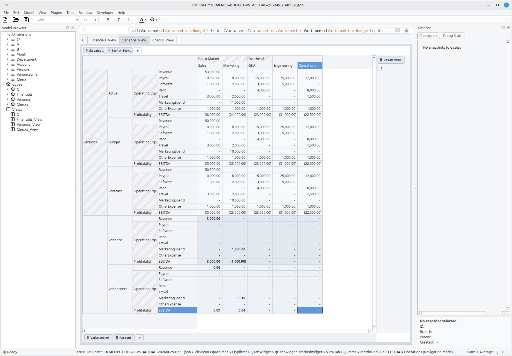
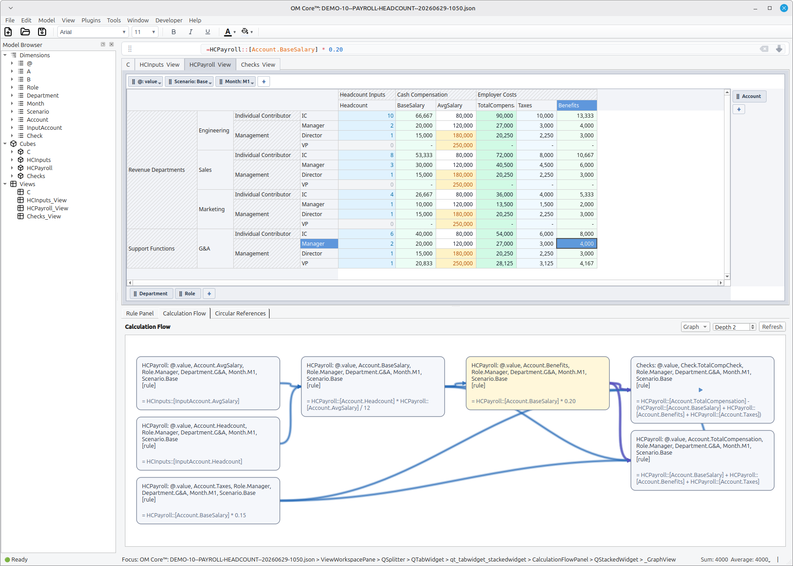
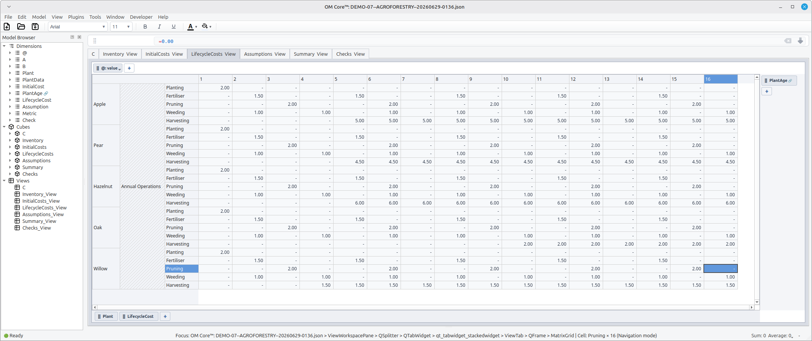
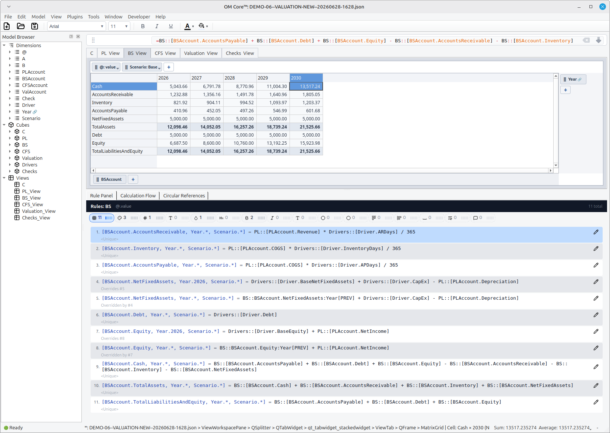
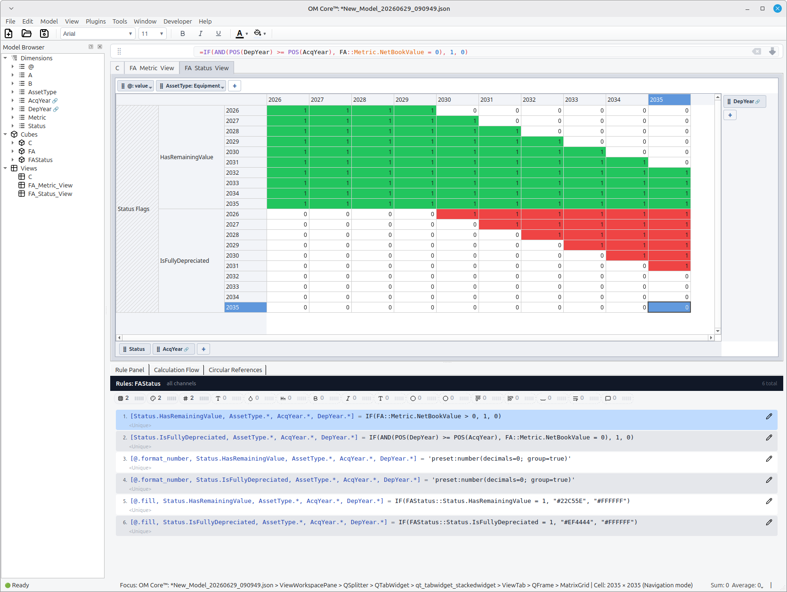
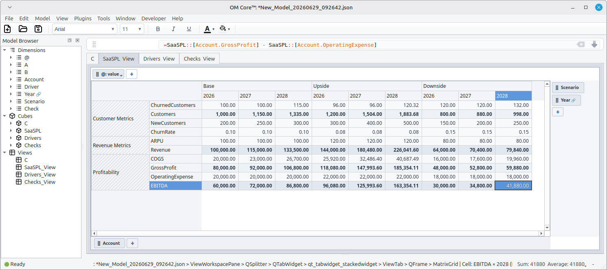
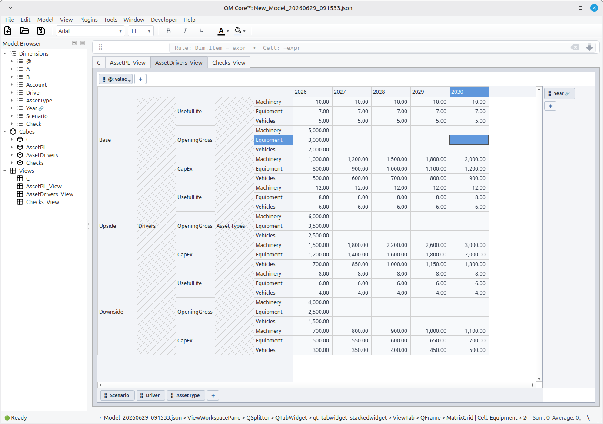

# Financial Modeling Examples

These example models are complete `.openm` script bundles. Each bundle includes
`build.openm` and numbered script files that can be loaded into OM Core.

For the full modeling conventions and agent instructions, see
[SKILLS.md](../SKILLS.md) or download the raw file directly from
[GitHub][skills-raw].

> These examples are intended as educational script-bundle patterns. They were
> generated by an LLM from a simple prompt and have not been independently
> validated. They are not investment advice, accounting advice, tax advice,
> valuation advice, or production-ready financial templates.

To run a model, load the bundle in the OM Core REPL:

```text
om> source build.openm
```

## Three-Statement Model

The flagship example. Shows an integrated P&L, Balance Sheet, and Cash Flow
Statement with scenarios, checks, and dimensional structure.

- [00_variables.openm](three-statement-model/00_variables.openm)
- [01_dimensions.openm](three-statement-model/01_dimensions.openm)
- [02_cubes.openm](three-statement-model/02_cubes.openm)
- [03_inputs.openm](three-statement-model/03_inputs.openm)
- [04_rules.openm](three-statement-model/04_rules.openm)
- [05_checks.openm](three-statement-model/05_checks.openm)
- [06_views.openm](three-statement-model/06_views.openm)
- [07_formatting.openm](three-statement-model/07_formatting.openm)
- [08_groups.openm](three-statement-model/08_groups.openm)
- [build.openm](three-statement-model/build.openm)



## Budget vs Actual / Forecast Variance Model

The FP&A example. Shows Actual, Budget, and Forecast as a `Version` dimension,
with calculated `Variance` and `VariancePct` across Account, Month, and
Department.

- [00_variables.openm](budget-vs-actual-model/00_variables.openm)
- [01_dimensions.openm](budget-vs-actual-model/01_dimensions.openm)
- [02_cubes.openm](budget-vs-actual-model/02_cubes.openm)
- [03_inputs.openm](budget-vs-actual-model/03_inputs.openm)
- [04_rules.openm](budget-vs-actual-model/04_rules.openm)
- [05_checks.openm](budget-vs-actual-model/05_checks.openm)
- [06_views.openm](budget-vs-actual-model/06_views.openm)
- [07_formatting.openm](budget-vs-actual-model/07_formatting.openm)
- [08_groups.openm](budget-vs-actual-model/08_groups.openm)
- [build.openm](budget-vs-actual-model/build.openm)



## Headcount and Payroll Planning

A core FP&A use case. Plans headcount by role, department, month, and scenario,
then rolls it up into base salary, benefits, taxes, and total compensation.
Demonstrates dimensional grouping for roles, departments, and account lines.

- [00_variables.openm](headcount-payroll-planning/00_variables.openm)
- [01_dimensions.openm](headcount-payroll-planning/01_dimensions.openm)
- [02_cubes.openm](headcount-payroll-planning/02_cubes.openm)
- [03_inputs.openm](headcount-payroll-planning/03_inputs.openm)
- [04_rules.openm](headcount-payroll-planning/04_rules.openm)
- [05_checks.openm](headcount-payroll-planning/05_checks.openm)
- [06_views.openm](headcount-payroll-planning/06_views.openm)
- [07_formatting.openm](headcount-payroll-planning/07_formatting.openm)
- [08_groups.openm](headcount-payroll-planning/08_groups.openm)
- [build.openm](headcount-payroll-planning/build.openm)



## Agroforestry Model

- [00_variables.openm](agroforestry-model/00_variables.openm)
- [01_dimensions.openm](agroforestry-model/01_dimensions.openm)
- [02_cubes.openm](agroforestry-model/02_cubes.openm)
- [03_inputs.openm](agroforestry-model/03_inputs.openm)
- [04_rules.openm](agroforestry-model/04_rules.openm)
- [05_checks.openm](agroforestry-model/05_checks.openm)
- [06_views.openm](agroforestry-model/06_views.openm)
- [07_formatting.openm](agroforestry-model/07_formatting.openm)
- [08_groups.openm](agroforestry-model/08_groups.openm)
- [build.openm](agroforestry-model/build.openm)



## Business Valuation Model

A DCF-style valuation built from integrated P&L, Balance Sheet, and Driver
assumptions. Working-capital items (Accounts Receivable, Inventory, Accounts
Payable) tie to Driver days; Net Fixed Assets roll forward with CapEx and
Depreciation; Equity and Debt feed the balance sheet; and Cash is the balancing
plug.

- [00_variables.openm](business-valuation-model/00_variables.openm)
- [01_dimensions.openm](business-valuation-model/01_dimensions.openm)
- [02_cubes.openm](business-valuation-model/02_cubes.openm)
- [03_inputs.openm](business-valuation-model/03_inputs.openm)
- [04_rules.openm](business-valuation-model/04_rules.openm)
- [05_checks.openm](business-valuation-model/05_checks.openm)
- [06_views.openm](business-valuation-model/06_views.openm)
- [07_formatting.openm](business-valuation-model/07_formatting.openm)
- [08_groups.openm](business-valuation-model/08_groups.openm)
- [build.openm](business-valuation-model/build.openm)



## Fixed Asset Depreciation by Tranche

Tracks each annual asset acquisition as a separate tranche and depreciates it
over its useful life. Uses two sequential base dimensions (`AcqYear` and
`DepYear`) plus a supplementary `Status` dimension that flags whether any net
book value remains or the tranche is fully depreciated.

- [00_variables.openm](fixed-asset-depreciation/00_variables.openm)
- [01_dimensions.openm](fixed-asset-depreciation/01_dimensions.openm)
- [02_cubes.openm](fixed-asset-depreciation/02_cubes.openm)
- [03_inputs.openm](fixed-asset-depreciation/03_inputs.openm)
- [04_rules.openm](fixed-asset-depreciation/04_rules.openm)
- [05_checks.openm](fixed-asset-depreciation/05_checks.openm)
- [06_views.openm](fixed-asset-depreciation/06_views.openm)
- [07_formatting.openm](fixed-asset-depreciation/07_formatting.openm)
- [08_groups.openm](fixed-asset-depreciation/08_groups.openm)
- [build.openm](fixed-asset-depreciation/build.openm)

> **Note:** When using `@.fill` or `@.font_color` with conditional formatting,
> color values must be passed as **string literals** inside the formula, e.g.
> `"#EF4444"` rather than `#EF4444`.



## SaaS Revenue Model

- [00_variables.openm](saas-revenue-model/00_variables.openm)
- [01_dimensions.openm](saas-revenue-model/01_dimensions.openm)
- [02_cubes.openm](saas-revenue-model/02_cubes.openm)
- [03_inputs.openm](saas-revenue-model/03_inputs.openm)
- [04_rules.openm](saas-revenue-model/04_rules.openm)
- [05_checks.openm](saas-revenue-model/05_checks.openm)
- [06_views.openm](saas-revenue-model/06_views.openm)
- [07_formatting.openm](saas-revenue-model/07_formatting.openm)
- [08_groups.openm](saas-revenue-model/08_groups.openm)
- [build.openm](saas-revenue-model/build.openm)



## Manufacturing CapEx & Depreciation Model

- [00_variables.openm](manufacturing-capex-model/00_variables.openm)
- [01_dimensions.openm](manufacturing-capex-model/01_dimensions.openm)
- [02_cubes.openm](manufacturing-capex-model/02_cubes.openm)
- [03_inputs.openm](manufacturing-capex-model/03_inputs.openm)
- [04_rules.openm](manufacturing-capex-model/04_rules.openm)
- [05_checks.openm](manufacturing-capex-model/05_checks.openm)
- [06_views.openm](manufacturing-capex-model/06_views.openm)
- [07_formatting.openm](manufacturing-capex-model/07_formatting.openm)
- [08_groups.openm](manufacturing-capex-model/08_groups.openm)
- [build.openm](manufacturing-capex-model/build.openm)



<!-- markdownlint-disable MD013 -->
[skills-raw]: https://raw.githubusercontent.com/cloudcell/om-docs/main/docs/skills/om-core-financial-modeling/SKILLS.md
<!-- markdownlint-enable MD013 -->
