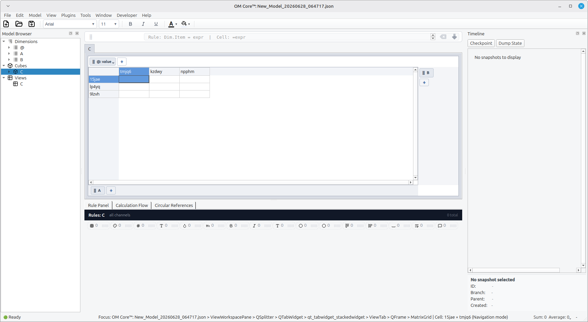
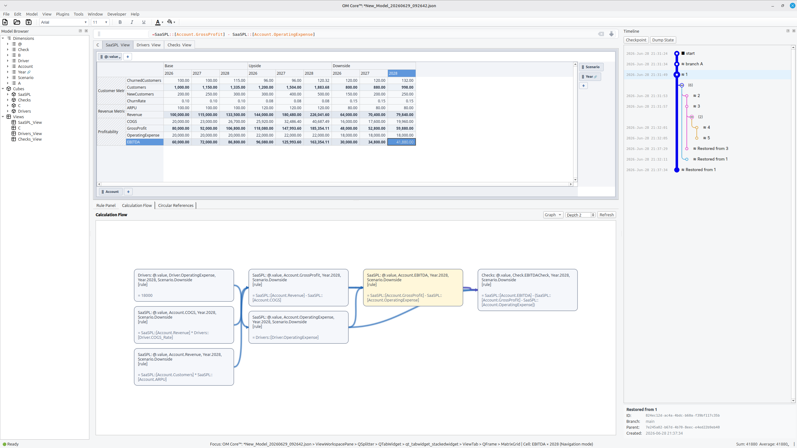
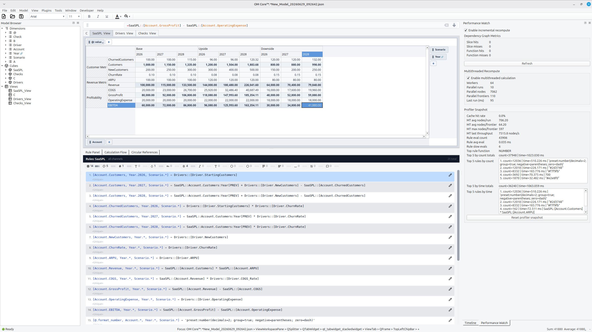
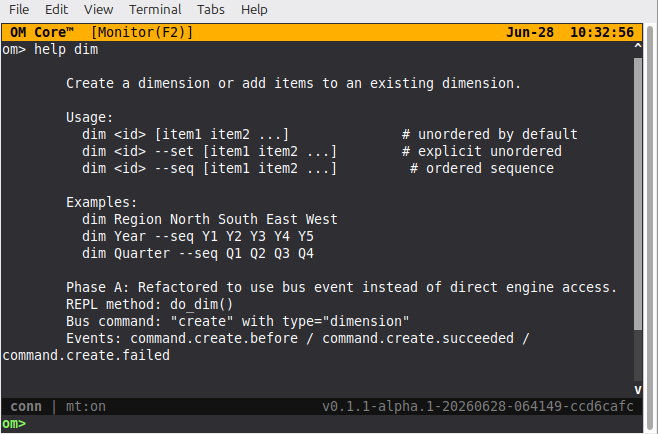
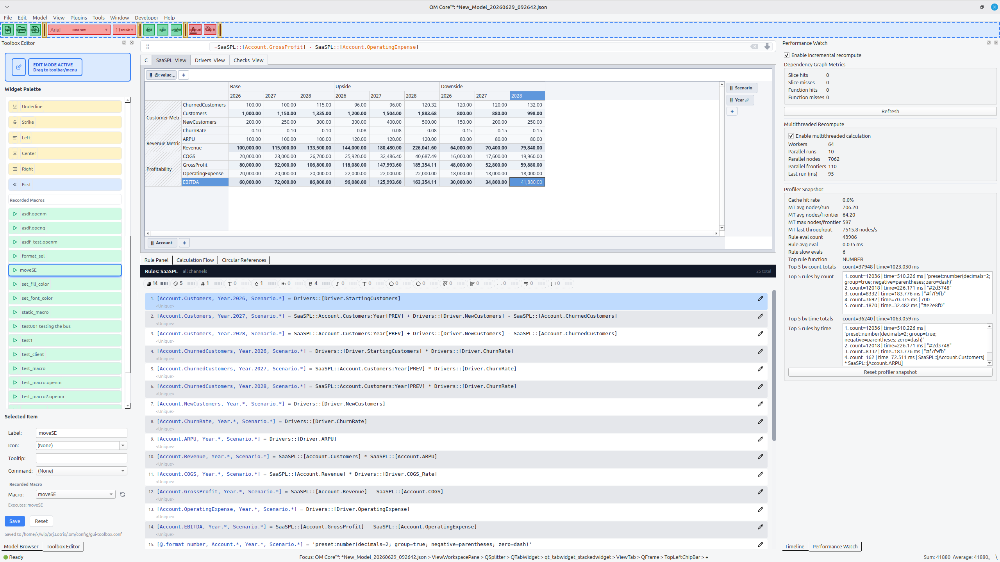

# Screenshot Gallery

This page collects all non-logo screenshots used across the documentation so
you can review and reuse them in one place.

## Interface

Screenshots of the OM Core GUI, TUI, and supporting tools.

## Models

Screenshots from the financial modeling examples shipped with the skill.

## Examples

Screenshots from other example models.

