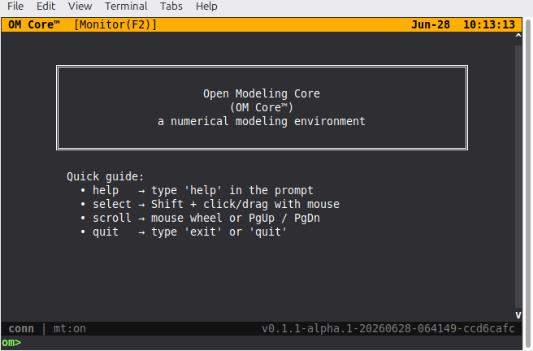
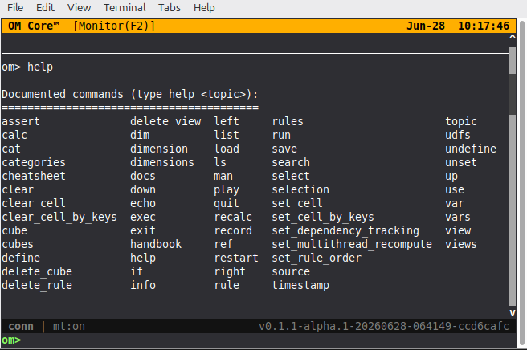
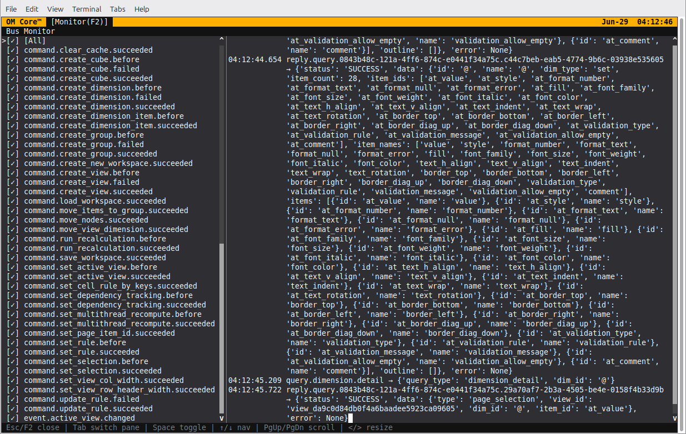

# Terminal UI (TUI)

OM Core can run in a terminal UI mode. Start it with:

```bash
./start.sh --tui
```

The TUI provides the same core modeling capabilities as the GUI, but rendered in the terminal for keyboard-driven workflows, remote access, or low-bandwidth environments.



## Layout

The TUI is divided into panes that mirror the GUI layout:

- **Model Browser** — a tree of dimensions, cubes, and views.
- **Matrix view** — the selected cube or view rendered as a grid.
- **Rule panel** — rules for the current selection or cube.
- **Command/status line** — a REPL-style input line at the bottom.

Navigation is keyboard-driven. Arrow keys move between panes and cells. The command line accepts the same `.openm` commands and REPL commands as the GUI.

## First command: help

The first command to type in the TUI is `help`. It lists every documented command and available topics.

```text
om> help
```



For help on a specific command:

```text
om> help rule
om> help calc
```

## Common commands

Once the TUI is open, type commands at the bottom line:

```text
source scripts/depreciation_schedule.openm
view PnL
calc
save model.json
```

See the [Scripting reference](../reference/scripting.md) for the full command set.

## Bus Monitor

The TUI includes a read-only **Bus Monitor** overlay (press `F2`) that shows the
live `MessageBus` trace. This is useful for debugging command flow, observing
command lifecycle events, and tracing correlations without leaving the terminal.



The monitor is split into a topic filter pane on the left and a formatted
message log on the right. Toggle topics with `Space`, navigate with the arrow keys
or `j`/`k`, and press `Esc` or `F2` again to close the overlay and return to the
REPL prompt.

## When to use the TUI

- You prefer keyboard-only interaction.
- You are working over SSH or a remote terminal.
- You want a lightweight alternative to the GUI.
- You are automating or recording a session.
- You need to inspect the bus trace while debugging rules or commands.

## See also

- [Interface overview](interface.md)
- [Quickstart](../start/quickstart.md)
- [Scripting reference](../reference/scripting.md)
